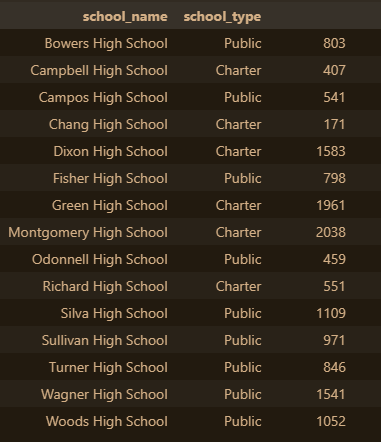

# School_District_Analysis
### Module 4 Challenge

# **Overview** 
    The task was to clean, organize, drill down into, and summarize data about students from 9th to 12th grade from a variety of different schools within a District. Data was explored using parameters such as student body count, school budgets, and average math and reading scores per grade.

### *Resources*
- new_full_student_data.csv
- Jupyter Notebook running Python 3.7.15

## **Summary**
#### An analysis of the student data shows that:
    Overall, Charter and Public schools seem to be fairly similar. Both started with fairly low average scores in reading and math. Charter schools had a higher increase in reading scores over time, with a decrease in math scores over time. Although Public schools were able to maintain relatively consistent math scores throughout all 4 grades, Charter schools saw a drop in average math scores over time.
    

    
    Population density of schools was fairly scattered with the exception being the most populated schools. The top 3 schools with the most students were all Charter schools. Meanwhile, the average School Budget was slightly higher for Public schools, which may have impacted the performance over time of the Charter schools; with less money per-student, it could be said that the resources to keep the students' quality of education over the course of four years was difficult. 
    

    
    There are exceptions, however, as Campbell High School is a charter school with both the third highest budget and one of the lowest student populations. Even with much more money per-student, though, Campbell still only achieved average scores in both Math and Reading, as shown below:

Another example is Montgomery High School, which had the highest population, with a budget close to the median. This should also show that dollars-per-student would impact their overall average scores, but they were actually very close to Campbell, while having five times the amount of students.

### *Potential Problems*

I believe we are not seeing the whole picture as to explain the wide variety of dollars-per-student. Additional data I would like to see is classroom size (students-per-teacher), as well as categories of where budgetary money is being spent, such as extracirriculars like music or sports, upper-supervisory salaries, and classroom enrichment technology. Access to affordable internet per student household could also make a difference in their education in the 21st century. This data leads us to believe that all schools within this District are performing largely the same, but it is my opinion that some pieces are certainly missing.

